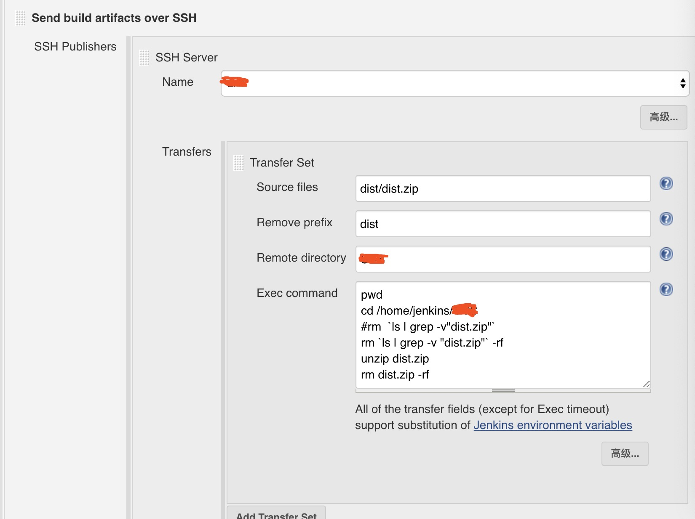

自动化部署 jenkins 是个好帮手！！！

<!--more-->

# 不想干前端的后端不是好全栈

编写代码=>提交代码=>拉取最新代码=>打包=>部署。
这种重复的体力活怎么能忍受，做好自己的事，安安静静地写 bug 不好吗，其他全都交给 [jenkins](https://jenkins.io/) 吧。

## 安装

当然使用 [docker](https://www.docker.com) 神奇来安装了

docker-compose.yml

```
version: "3"
services:
  jenkins:
    image: jenkins/jenkins:lts
    container_name: docker-jenkins
    volumes:
      - ./jenkins_home:/var/jenkins_home
    ports:
      - 40001:8080
      - 50000:50000
```

文件挂在 jenkins_home 下，暴露 40001，50000 端口

```
docker-compose up -d
```

浏览器打开http://ip:40001 就可以看到 jenkins 启动的配置页面了。

首次需要密码,执行下面脚本，copy 密码。

```
docker exec -it docker-jenkins /bin/bash
cat /var/jenkins_home/secrets/initialAdminPassword
```

安装建议的插件

- nodejs
- publish over ssh

## 配置一个项目

TODO

### General

### 源码管理

git

### 构建触发器

GitHub hook trigger for GITScm polling

### 构建环境

Provide Node & npm bin/ folder to PATH

### 构建

执行 shell

```
#echo $PATH
echo "开始构建"
npm install -g cnpm --registry=https://registry.npm.taobao.org
# 安装依赖
cnpm i
# 打包
npm run dll
npm run build
```

### 构建后操作

Send build artifacts over SSH

<!--  -->

<!---->


